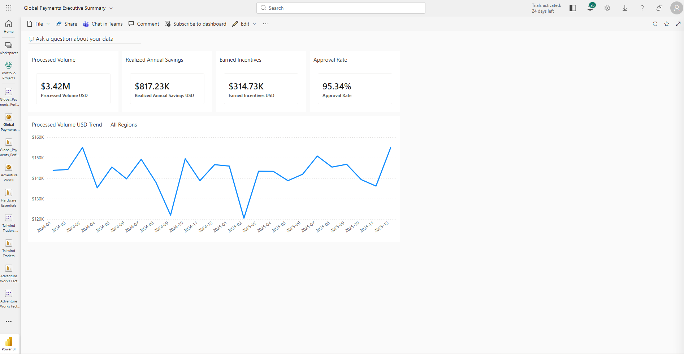

# Global Payments Performance

**An interactive Power BI portfolio project exploring processor performance, payment fees, savings opportunities, and network incentives.**

`Power BI` · `Power Query` · `DAX` · `Data Modeling` · `Desktop + Mobile`

> **Portfolio note:** This project uses synthetic, anonymized data. The figures in the report are illustrative and are not client results.

## Report pages

### Executive Overview

### Processor Performance

### Fee Optimization

### Network Incentives

## The question

Payments teams need to understand more than transaction volume. Are approval rates changing? Which processors or markets warrant a closer look? Where do billed fees differ from expectations, and how much of an identified savings opportunity has been realized? I built this report to bring those questions into one navigable view.

## Explore the report

| Page | What it helps a reader investigate |
| --- | --- |
| **Executive Overview** | Key payment measures and trends, with an interactive metric selector. |
| **Processor Performance** | Volume, approval rates, fees, and invoice variance by processor; a custom tooltip and drillthrough provide more detail. |
| **Fee Optimization** | Expected versus realized savings, initiative status, and fee variance. |
| **Network Incentives** | Qualifying volume versus targets, earned incentives, and qualification status. |

## How I built it

- Prepared the data with Power Query, including cleaning, merges, appends, and staging queries that do not load into the model.
- Organized transaction, invoice, optimization, and incentive data around shared date, market, processor, and network dimensions.
- Created DAX measures for payment volume, approvals, fees, savings, and incentives, including time-based comparisons.
- Added synced slicers, a dynamic executive trend, a processor tooltip and drillthrough page, and mobile layouts for the four main pages.
- Tested slicer interactions, the metric selector, tooltip and drillthrough behavior, and data refresh.

## Design decisions

After initial feedback on the layout, I reviewed the remaining pages and applied improvements across the visuals myself. I adjusted font sizes, text wrapping, and chart dimensions to make labels more readable on desktop and mobile. I kept detailed tables on the desktop pages and prioritized KPIs and charts in the mobile layouts.

## What I learned

The most useful measures depend on the question being asked and the filters applied. Building this report gave me practice carrying an operations question from data preparation through modeling, DAX, visual design, and validation. It also taught me to test a report as a reader would: change filters, follow a drillthrough, check narrow screens, and confirm that the refreshed report still behaves as intended.

### Power BI Service dashboard

I published the report to Power BI Service and created an executive dashboard with four KPI tiles and a processed-volume trend. Selecting a tile opens the detailed report.

